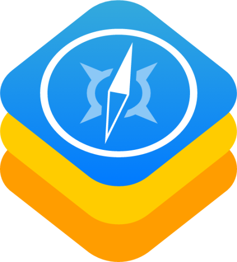
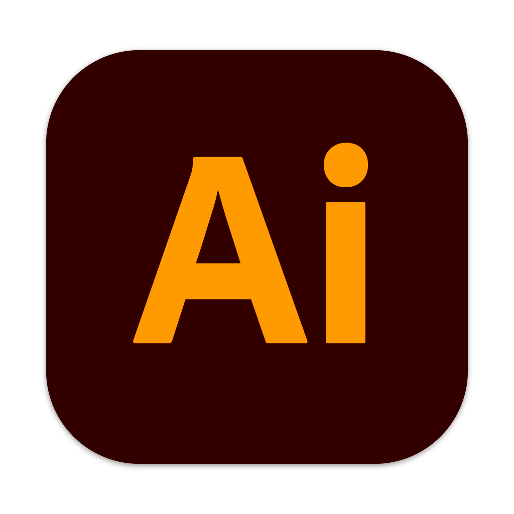
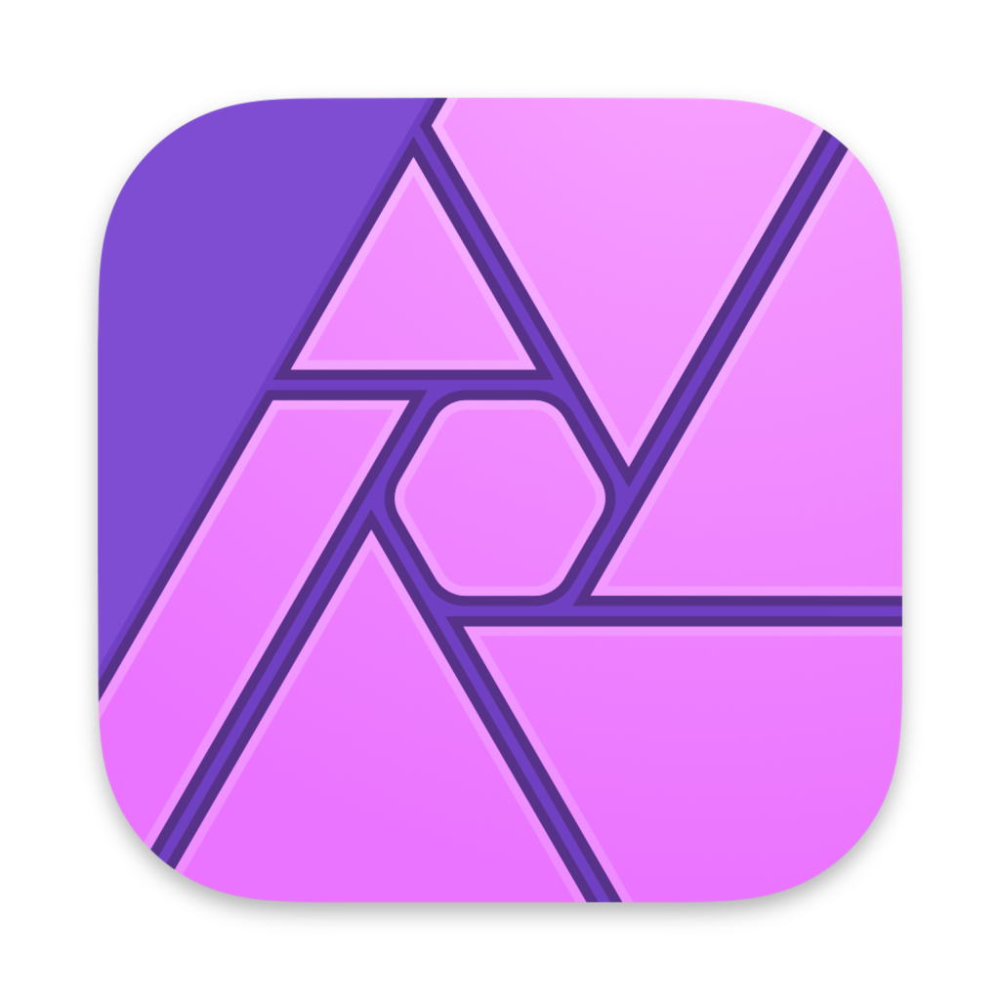
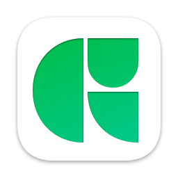

### Hi Im Tony Kastaneda 👋

A creative professional that solves creative problems with creative solutions.
A 1/32 Stack Dev that build things for designers alike

---
* 🔭 I’m currently working on frontend webdesigns for easy deployment to better help my clients and there needs
* 🌱 I’m currently learning React.js to help design systems and understand programming limitations when talked about in the greater context of desing and its fundementals
* 🏗️ Building a Design Agency over @ [BELLROSE® Desing & Co.][bellrose]
* 💥 2021 Goals: Build automated workflows in the cloud to remove hardware dependency in design pipelines
* ⚡ Fun fact: I'm an Audio Engineer by night

---
### Reach Me Here:
[][behance]&nbsp;&nbsp;
[][dribbble]&nbsp;&nbsp;
[][linkedin]&nbsp;&nbsp;
[][instagram]&nbsp;&nbsp;
[][twitter]&nbsp;&nbsp;
[][email]&nbsp;&nbsp;
[][website]&nbsp;&nbsp;

### Tools and Languages:
[][photoshop] &nbsp;&nbsp;
[][illustrator] &nbsp;&nbsp;
[][indesign] &nbsp;&nbsp;
[][lightroom] &nbsp;&nbsp;
[][xd] &nbsp;&nbsp;
[][audition] &nbsp;&nbsp;
[][premiere] &nbsp;&nbsp;
[][aftereffects] &nbsp;&nbsp;
[][affinity] &nbsp;&nbsp;
[][affinityphoto] &nbsp;&nbsp;
[][glyph] &nbsp;&nbsp;
[][cavalry] &nbsp;&nbsp;
[][motion] &nbsp;&nbsp;
[][vim] &nbsp;&nbsp;
[][atom] &nbsp;&nbsp;
[][vscode] &nbsp;&nbsp;
[][webstorm] &nbsp;&nbsp;
[][sublime] &nbsp;&nbsp;
[][xcode] &nbsp;&nbsp;
[][swift] &nbsp;&nbsp;
 &nbsp;&nbsp;
 &nbsp;&nbsp;
 &nbsp;&nbsp;
 &nbsp;&nbsp;
[][figma] &nbsp;&nbsp;
[][finalcut] &nbsp;&nbsp;
[][logic] &nbsp;&nbsp;
[][hype4] &nbsp;&nbsp;
[][inkscape] &nbsp;&nbsp;
[][resolve] &nbsp;&nbsp;
[][sketch] &nbsp;&nbsp;
[][spline] &nbsp;&nbsp;
[][webflow] &nbsp;&nbsp;

[website]: https://tony.bellrosedesign.com
[twitter]: https://twitter.com/TKastaneda
[dribbble]: https://dribbble.com/tonykastaneda
[behance]: https://www.behance.net/tonykastaneda
[instagram]: https://www.instagram.com/tonykastaneda/
[bellrose]: https://www.bellrosedesign.com
[email]: tonykastaneda@gmail.com
[linkedin]: https://www.linkedin.com/in/tonykastaneda/
[website]: https://tony.bellrosedesign.com

[photoshop]: https://www.adobe.com/products/photoshop.html
[illustrator]: https://www.adobe.com/products/illustrator.html
[indesign]: https://www.adobe.com/products/indesign.html
[xd]: https://www.adobe.com/products/xd.html
[audition]: https://www.adobe.com/products/audition.html
[premiere]: https://www.adobe.com/products/premiere.html
[aftereffects]: https://www.adobe.com/products/aftereffects.html
[affinity]: https://affinity.serif.com/en-us/designer/
[glyph]: https://glyphsapp.com/
[cavalry]: https://cavalry.scenegroup.co/
[motion]: https://www.apple.com/final-cut-pro/motion/
[atom]: https://atom.io/
[affinityphoto]: https://affinity.serif.com/en-us/photo/
[figma]: https://www.figma.com/
[finalcut]: https://www.apple.com/final-cut-pro/
[hype4]: https://tumult.com/hype/
[inkscape]: https://inkscape.org/
[lightroom]: https://www.adobe.com/products/photoshop-lightroom.html
[logic]: https://www.apple.com/logic-pro/
[resolve]: https://www.blackmagicdesign.com/products/davinciresolve/
[sketch]: https://www.sketch.com/
[spline]: https://spline.design/
[sublime]: https://www.sublimetext.com/
[swift]: https://developer.apple.com/swift/
[vscode]: https://code.visualstudio.com/
[webflow]: https://webflow.com/
[webstorm]: https://www.jetbrains.com/webstorm/
[xcode]: https://developer.apple.com/xcode/
[vim]: https://github.com/vim/vim
